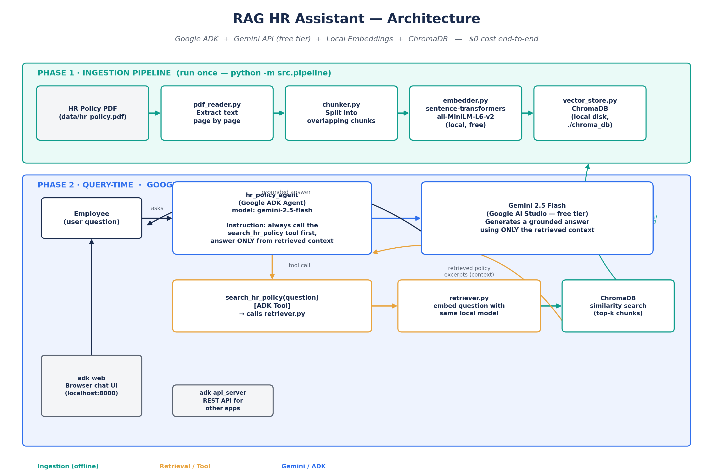

# RAG HR Assistant

A Retrieval-Augmented Generation (RAG) chatbot that answers employee questions
from a company's HR policy document — built end-to-end on **Google's Agent
Development Kit (ADK)** and the **free tier of the Gemini API**, with a fully
local, free retrieval stack. **Total cost to build and run this project: $0.**

> Ask it "How many days of annual leave do I get?" and it retrieves the exact
> relevant clause from the HR policy PDF and answers *only* from that context —
> not from the model's general knowledge.

---

## Architecture



The system has two phases:

1. **Ingestion pipeline** (run once, offline): a PDF is read, split into
   overlapping chunks, embedded locally, and stored in a vector database on
   disk.
2. **Query-time agent** (Google ADK): the user's question is handed to a
   Gemini-powered ADK agent, which calls a retrieval **tool** to pull the most
   relevant chunks from the vector database, then generates an answer
   grounded strictly in that retrieved text.

---

## Tech stack

| Layer | Technology | Why | Cost |
|---|---|---|---|
| Agent framework | **Google Agent Development Kit (ADK)** | Production-style agent runtime with tool-calling, a built-in dev UI (`adk web`), and a REST server (`adk api_server`) out of the box | Free (open source) |
| LLM | **Gemini 2.5 Flash** (Google AI Studio) | Fast, capable, first-class ADK model provider — no adapter needed | Free tier |
| Embeddings | **sentence-transformers** (`all-MiniLM-L6-v2`) | Runs entirely on your own machine — no API call, no rate limit, no key | Free, local |
| Vector database | **ChromaDB** (persistent, local) | Zero-setup vector store that lives in a folder on disk | Free, local |
| PDF parsing | **pypdf** | Lightweight, reliable text extraction | Free |
| Orchestration | Plain Python | Easy to read, easy to extend | — |

**No OpenAI key. No Pinecone account. No credit card, anywhere.** The only
credential in the whole project is a free Gemini API key from Google AI
Studio.

---

## Project structure

```
rag-hr-assistant/
├── README.md
├── requirements.txt
├── .env.example                  # root env (used by scripts/terminal_chat.py)
├── .gitignore
├── LICENSE
├── docs/
│   └── architecture.png          # architecture diagram (this README)
├── data/
│   └── hr_policy.pdf             # sample HR policy document to ingest
├── src/
│   ├── paths.py                  # shared, cwd-independent path config
│   ├── pipeline.py                # Phase 1 orchestrator (run this first)
│   ├── ingestion/
│   │   ├── pdf_reader.py           # step 1: PDF -> raw text per page
│   │   ├── chunker.py               # step 2: text -> overlapping chunks
│   │   ├── embedder.py               # step 3: chunks -> local embeddings
│   │   └── vector_store.py            # step 4: store in local ChromaDB
│   └── retrieval/
│       └── retriever.py            # embed a question, search ChromaDB
├── hr_policy_agent/               # Google ADK agent (primary interface)
│   ├── agent.py                    # root_agent + search_hr_policy tool
│   └── .env.example                 # agent's own Gemini key
└── scripts/
    └── terminal_chat.py           # optional: plain terminal chat loop
```

Each ingestion step is independently runnable and testable
(`python -m src.ingestion.chunker`, etc.) — the pipeline is a thin
orchestrator on top of small, single-purpose modules rather than one
monolithic script.

---

## Setup

### 1. Clone and install

```bash
git clone <your-repo-url> rag-hr-assistant
cd rag-hr-assistant
python -m venv venv
source venv/bin/activate        # Windows: venv\Scripts\activate
pip install -r requirements.txt
```

### 2. Get a free Gemini API key

Go to **[aistudio.google.com/apikey](https://aistudio.google.com/apikey)** and
create a key — no credit card required, Gemini Flash models are covered by
the free tier.

Then set the key in **two** places (ADK loads `.env` from inside the agent's
own folder, so it needs its own copy):

```bash
cp .env.example .env
cp hr_policy_agent/.env.example hr_policy_agent/.env
```

Edit both files and paste in your key:
```
GOOGLE_API_KEY=your-actual-gemini-key
GOOGLE_GENAI_USE_VERTEXAI=FALSE
```

### 3. Build the vector database (Phase 1 — run once)

```bash
python -m src.pipeline
```

This reads `data/hr_policy.pdf`, chunks it, embeds it locally, and creates a
`chroma_db/` folder at the project root — that folder **is** your vector
database. Delete it anytime and re-run this command to rebuild from scratch.

> **First run only:** `sentence-transformers` downloads the
> `all-MiniLM-L6-v2` model (~90MB) once from Hugging Face. After that,
> everything — ingestion *and* retrieval — runs fully offline.

To use your **own** PDF instead of the sample policy, replace
`data/hr_policy.pdf` (or pass a path to `process_document()` in
`src/pipeline.py`) and re-run the command above.

### 4. Run the agent

**Option A — browser UI** (best for demoing / trying it out):
```bash
adk web
```
Open the printed URL (usually `http://localhost:8000`), select
`hr_policy_agent` from the dropdown, and chat.

**Option B — REST API** (best for calling it from another app):
```bash
adk api_server
```

Run both commands **from the project root**, not from inside
`hr_policy_agent/` — ADK discovers agent folders relative to your current
directory, and that's also what lets `chroma_db/` resolve correctly.

**Option C — plain terminal loop** (no ADK, quick sanity check):
```bash
python -m scripts.terminal_chat
```

---

## How it works

1. **`pdf_reader.py`** extracts raw text from every page of the source PDF.
2. **`chunker.py`** joins the pages and splits the text into ~900-character
   chunks with 150-character overlap, so no sentence is lost at a chunk
   boundary.
3. **`embedder.py`** turns each chunk into a 384-dimension vector using
   `all-MiniLM-L6-v2`, downloaded once and cached locally.
4. **`vector_store.py`** upserts every `(chunk, embedding)` pair into a
   persistent ChromaDB collection on disk.
5. At query time, **`hr_policy_agent/agent.py`** defines a `search_hr_policy`
   tool. The agent's instruction *forces* it to call this tool before
   answering anything — the tool re-embeds the question with the same local
   model and runs a similarity search against ChromaDB via
   **`retriever.py`**.
6. The retrieved chunks are returned to the agent as context. **Gemini 2.5
   Flash** then generates an answer using *only* that context — if the
   answer isn't in the retrieved chunks, the agent says so instead of
   guessing.

This retrieve-then-generate loop is what makes the answers **grounded**: the
model can't hallucinate a leave policy that isn't in the document, because it
never sees anything beyond what retrieval hands it.

---

## Example interaction

```
You: How many days of annual leave do I get?

Assistant: According to the HR policy, employees are entitled to 18 days
of paid annual leave per calendar year, accrued monthly...
```

---

## Design notes / trade-offs

- **`all-MiniLM-L6-v2` vs. a paid embedding API** — smaller and a little
  less accurate than something like OpenAI's `text-embedding-3-small`, but
  it's a widely-used, genuinely solid model for retrieval, and it means
  ingestion never touches the network after the first model download.
- **ChromaDB vs. a hosted vector DB (e.g. Pinecone)** — a local persistent
  client is enough for a single-document / small-corpus assistant like this
  one, and it means zero infrastructure to provision or pay for. Swapping in
  a hosted vector store later only requires changing `vector_store.py` and
  `retriever.py`.
- **Chunking is fixed-size + overlap**, not semantic chunking — simple,
  fast, and predictable. A natural next step (see below) is to chunk by
  section/heading instead.
- **`hr_policy_agent/` vs. `scripts/terminal_chat.py`** — both do the same
  retrieve→generate flow; the ADK agent is the "real" interface (dev UI,
  REST server, tool-calling, extensible to more tools), while the terminal
  script is a minimal way to sanity-check retrieval and generation without
  standing up the agent server.

## Possible extensions

- Swap the single-tool agent for a multi-tool one (e.g. add a tool that
  looks up an employee's leave balance from an HR system).
- Add conversation memory so follow-up questions ("...and how does that
  compare to sick leave?") resolve correctly.
- Chunk by document section instead of fixed character count.
- Add a lightweight eval set (question → expected policy clause) to measure
  retrieval quality as the chunking/embedding strategy changes.
- Deploy `adk api_server` behind a small frontend for a shareable demo link.

---

## License

MIT — see [LICENSE](LICENSE).
